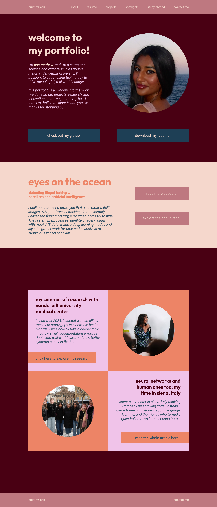

# 🌐 Ann Mathew – Portfolio Website

Welcome to my personal portfolio website!  
Built to share my academic background, project work, research experiences, and extracurricular involvement, this site serves as a curated snapshot of who I am as a student, creator, and changemaker.

🔗 **Live site**: _Coming Soon_  
🎨 **Designed in**: Figma (see preview below)  
🛠️ **Built with**: React • Tailwind CSS • GitHub Pages

---

## 📌 About This Project

This portfolio is a dynamic space where I share:
- 🌱 Research and coursework across computer science, climate studies, and anthropology
- 🚀 Independent and team-based technical projects
- 🌍 Global learning experiences through study abroad
- 🎓 Leadership, service, and outreach through student organizations

Every page is designed to reflect not only what I've done — but how I think, grow, and contribute.

---

## 🚧 Project Status

✅ Homepage fully built  
🖼️ Figma homepage layout implemented exactly  
🚧 Currently working on:
- GitHub Pages deployment  
- Internal routing and navigation  
- Additional pages: Projects, Resume, Study Abroad, etc.  
- Responsiveness and accessibility

---

## ✨ Figma Design Preview

Here's the original homepage design that this project is built from:



---

## 🧰 Tech Stack

- **Frontend**: React + Tailwind CSS  
- **Design**: Figma  
- **Hosting**: GitHub Pages  
- **Version Control**: Git

---

## 🔍 Pages & Sections (Planned)

- **Home**: Hero section and intro to who I am ✅  
- **Projects**: Interactive showcase of selected technical and research work  
- **Spotlights**: Deeper dives into standout experiences  
- **Resume**: Downloadable PDF and quick-view highlights  
- **Study Abroad**: Reflections and documentation of international learning  
- **Contact**: Ways to reach me or follow my work

---

## 📂 File Structure

```bash
/
├── public/
│   ├── friends.JPG
│   ├── present.jpg  
│   ├── profile.png
│   └── vite.svg
├── src/
│   ├── components/
│   │   ├── Button.jsx
│   │   ├── Eyes.jsx
│   │   ├── Footer.jsx
│   │   ├── Hero.jsx
│   │   ├── Navbar.jsx
│   │   └── SpotlightSection.jsx
│   ├── App.jsx
│   ├── index.css
│   └── main.jsx
├── README.md
├── index.html
├── tailwind.config.js
├── vite.config.js
├── package.json
├── .gitignore
├── postcss.config.js
├── eslint.config.js
├── package-lock.json
└── .DS_Store
```

---

## 🤝 Contributions
This site is fully authored and maintained by me, and I hope to get it live it by the end of Summer 2025!

## 📬 Contact
- Email: ann.e.mathew@gmail.com
- GitHub: https://github.com/built-by-ann

Thanks for visiting ✨
