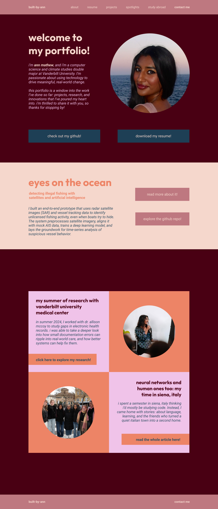

# built-by-ann.github.io

A personal portfolio site designed from scratch in Figma and built with React, TypeScript, and Vite — deployed to GitHub Pages.

## Project Overview

This site is a fully custom portfolio built without any component libraries, CSS frameworks, or prebuilt design systems. Every layout, color choice, typographic decision, and interaction was designed first in Figma and then translated directly into code using hand-written React components and inline styles.

The site showcases my projects, research experience, resume, and study abroad work through a multi-page React application with client-side routing, static asset hosting, and a custom scaling system for consistent rendering across screen sizes.

## Preview



## Goals

- Design a cohesive visual identity from scratch (typography, color palette, spacing system, layout)
- Translate a Figma prototype into a production React application without relying on UI libraries
- Deploy a single-page application to GitHub Pages with working deep-link routing
- Build a consistent, readable experience across desktop and mobile devices
- Showcase technical projects and research with enough context to tell the actual story behind each one

## Pages

| Page | Description |
|------|-------------|
| Home | Hero section with photo, intro text, and entry points into the site |
| Spotlights | Four featured projects with full descriptions, skill chips, and links |
| Projects | All 10 projects listed with descriptions, tools, and links |
| Resume | Embedded PDF resume with a download button |
| About | Background, interests, and more about me |
| Study Abroad | Photos and reflections from my semester in Siena, Italy |
| Contact | Ways to get in touch |

## Technical Stack

| Layer | Tech |
|-------|------|
| Framework | React 18 |
| Language | TypeScript |
| Bundler | Vite |
| Routing | React Router v7 |
| Styling | Inline styles (no CSS framework) |
| Fonts | Google Fonts — Outfit (headings), Roboto (body) |
| Deployment | GitHub Pages via `gh-pages` |

## Design Process

The site began as a Figma prototype. I designed the full layout, including the fixed 1440px grid, color palette (`#490013`, `#ed8466`, `#f0c3e9`, `#be7880`, `#f5d7cc`), type scale, section structures, and component hierarchy.

After finalizing the design, I built the application component by component, working through each page and section until the live site matched the prototype. The process reinforced how design decisions translate into engineering constraints: spacing systems, visual hierarchy, and interaction patterns all have real implementation implications.

## Engineering Notes

**SPA routing on GitHub Pages**

GitHub Pages serves static files and doesn't support client-side routing out of the box. Navigating directly to `/projects` or reloading a page returns a 404. This is solved with a two-part redirect pattern:

1. A `public/404.html` file catches all GitHub 404s, encodes the intended path into the query string, and redirects to the root
2. A script in `index.html` decodes the query string and calls `history.replaceState` to restore the correct URL before React Router initializes

**Mobile scaling**

The layout is built on a fixed 1440px design width. To support smaller screens, the viewport meta tag is dynamically set to `width=1440, initial-scale=(screen.width / 1440)` for screens narrower than 1440px. This tells the browser to render the page at 1440px and scale it down proportionally, which preserves the layout without rewriting it for mobile. On desktop, a CSS `zoom` on the `html` element scales the layout to fill narrower browser windows.

**Static assets**

All static files (PDFs, images, SVGs) live in `public/files/` and are served at `/files/` in production. Vite copies the `public/` directory as-is to `dist/` during build.

## Project Structure

```
built-by-ann.github.io/
├── components/             # Shared components used across pages
│   ├── Footer.tsx
│   ├── Hero.tsx
│   ├── Navbar.tsx
│   ├── Project.tsx
│   ├── SpotlightGrid.tsx
│   └── SpotlightsSection.tsx
├── public/
│   ├── 404.html            # GitHub Pages SPA routing fix
│   └── files/              # Static assets (PDFs, images)
├── src/
│   ├── pages/              # One file per route
│   │   ├── AboutPage.tsx
│   │   ├── ContactPage.tsx
│   │   ├── HomePage.tsx
│   │   ├── ProjectsPage.tsx
│   │   ├── ResumePage.tsx
│   │   ├── SpotlightsPage.tsx
│   │   └── StudyAbroadPage.tsx
│   ├── App.tsx             # Route definitions
│   ├── main.tsx            # React entry point
│   └── styles.css          # Global resets only
├── index.html              # Vite entry, viewport + scaling logic
├── vite.config.ts
├── tsconfig.json
└── package.json
```

## Local Development

```bash
npm install
npm run dev       # starts dev server at localhost:5173
```

## Deployment

```bash
npm run deploy    # runs tsc && vite build && gh-pages -d dist
```

This builds the project, outputs to `dist/`, and pushes the `dist/` folder to the `gh-pages` branch, which GitHub Pages serves automatically.

## Author

Ann Mathew

Thanks for checking out my site!
